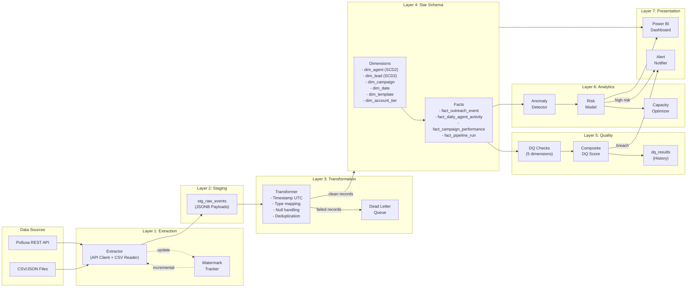
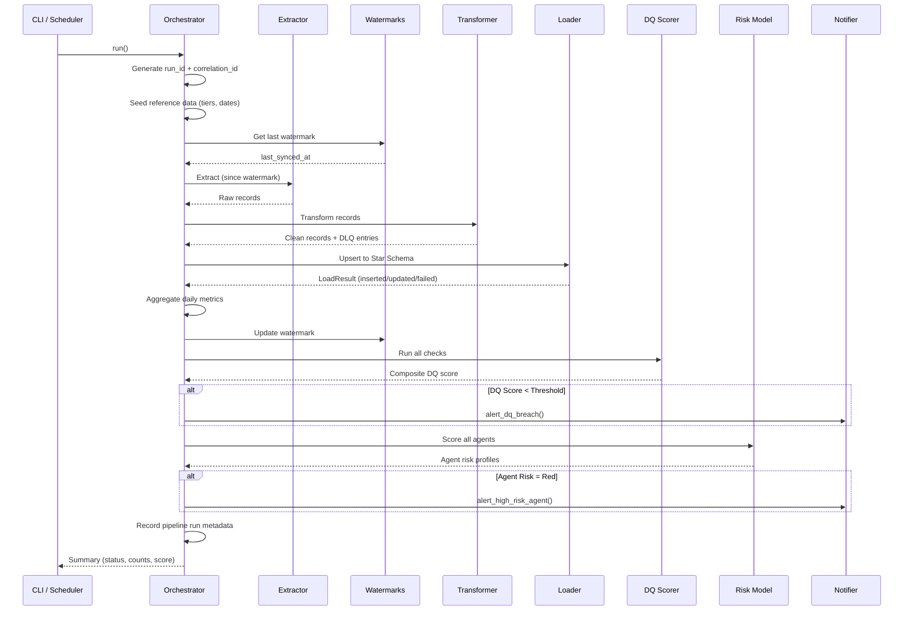

# Data Flow Architecture — Polluxa Analytics Platform

## End-to-End Data Flow

## Pipeline Execution Sequence

## Layer Responsibilities

| Layer | Purpose | Tables/Components |
|-------|---------|-------------------|
| **Source** | Raw data origin | Polluxa API, CSV/JSON exports |
| **Extraction** | Fetch data incrementally | `PolluaxAPIClient`, `CSVExtractor`, `pipeline_watermarks` |
| **Staging** | Preserve raw data | `stg_raw_events` (JSONB payloads) |
| **Transformation** | Clean, validate, standardize | `DataTransformer`, `DeadLetterQueue` |
| **Star Schema** | Dimensional model for analytics | 6 dimensions + 4 fact tables |
| **Quality** | Validate and score data | `DQChecks`, `DQScorer`, `dq_results` |
| **Analytics** | Detect risk and optimize | `AnomalyDetector`, `RiskModel`, capacity recommendations |
| **Presentation** | Visualize and alert | Power BI dashboard, webhook/email alerts |
